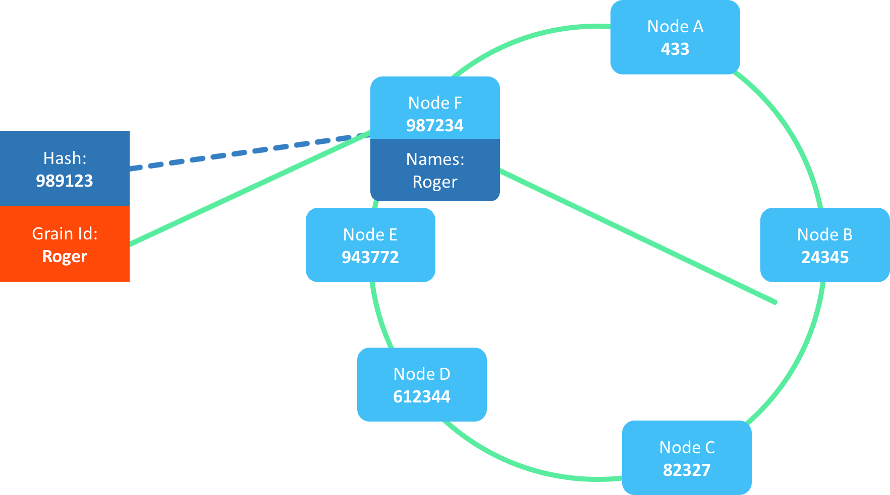

# Proto.Cluster

## Virtual Actors

Proto.Cluster leverages the "Vritual Actor Model", which was pioneered by Microsoft Orleans.
Unlike the traditional Actor Model used in Erlang or Akka, where developers must care about actor lifecycles, placement and failures.
The virtual actor model instead focus on ease of use, high availability where most of the complexity have been abstracted away from the developer.

The Microsoft Orleans website describes this as *A straightforward approach to building distributed, high-scale applications in .NET*.

Proto.Actor combines this way of clustering, with the traditional actor model to combine the best of both worlds.
This allows us to create huge clusters of stateful services where the virtual actors acts as entry points which in turn can contain entire graphs of local actors.

This offers us a unique way to optimize for data locality, while still offering ease of use at scale.

Just like everything else in Proto.Actor where we have re-used proven technologies such as Protobuf and gRPC, we do the same for clustering, we do not reinvent the wheel and create our own cluster mechanics.
Instead, we leverage proven technologies such as Consul.

## Consul Cluster

This means that Consul manages the cluster formation:

## Proto Cluster

On top of this, we attach the Proto.Actor members:

## Name to Member affinity

Each member gets a hash-code, this hash-code is based on host + port + unique id of the member.

This means that we now have what is called a "hash ring".
A hash ring can be to locate what member in a cluster should own certain resources.

In this specific case, we want to talk to the actor named "Roger", which gives the hash-code 989123 (an example only)

By matching the hash-code against the hash ring, we can see that the member closest to the given actor name is the member "E".

## Actor Activations

What is important to understand here is that the member "E" in this case, do not own the **actor**, just the **name** "Roger".

The Actor itself is then spawned or "activated" somewhere in the cluster.
This might seem strange at first, why do we need this two step structure for locating actors?

## Dealing with Topology Changes

The reason for this is to deal with topology changes.
In the case members join or leave the cluster, the topology change, and the shape of the hash ring is altered slightly.

This in turn means that the name of the actor, might now be owned by another node.
And by having this two-step structure, we only need to transfer the ownership of the name itself and not the actor and all of its state.

This model makes the cluster extremely robust to failures, only parts of the cluster will fail when a member leaves, and nothing will fail when a member joins the cluster.

In this specific case, even if all members except B and F leaves, the specific actor here is still reachable.

## Multiple Activations

One drawback of this approach is what is known as **Multiple Activations**

This can occur when the node that owns the name of an actor unexpectedly leaves the cluster.
This leaves the actor activation orphaned somewhere in the cluster.

Should someone now try to call this actor, a new node will be associated with the name, and the actor will be activated again somewhere in the cluster.

This means that we now have two active instances of the same actor, one orphaned and one with a proper name lookup association.

This *can* lead to issues if you rely on the actor concurrency constraint of one message at any given time.

In many cases, this is not an issue, as the orphaned actor is now unreachable, the name lookup now points to another instance.
Thus, no new messages will be sent to it.

In case the orphaned actor have some behavior on its own, chances are that it might cause race conditions between its own state changes and the new activation.

This can be prevented by persisting state in a database with some form of CAS operations, e.g. Couchbase.

In case the two instances change any state, this can now be detected by CAS changes.

## FAQ

### Communicate with Virtual Actors

In order to send messages to a virtual actor, you need to get hold of the `PID`.

You do this using the `Cluster.GetAsync("name","kind")` in C#, and `cluster.Get("name","kind")` in Go.

This gives you the PID, *and* a status.
e.g. the status could tell you that the specific Kind you requested are not yet available, possibly due to no such node having joined the cluster yet.

This allows you to re-try getting the PID by calling the Cluster.Get untill it succeeds.

It is also important to understand that the PID should be treated as a transient resource in this case, do not store it or pass it around.
The PID only points to the current activation of the actor, and can very well change over time.

The idiomatic way is to always call Cluster.Get whenever you want to reach a virtual actor.

### Generate Typed Virtual Actors

//TODO

Show examples how to codegen grains

## Hybrid Clusters: C#, Go and Kotlin

//TODO

## Technical Details

//TODO Hashing algorithm